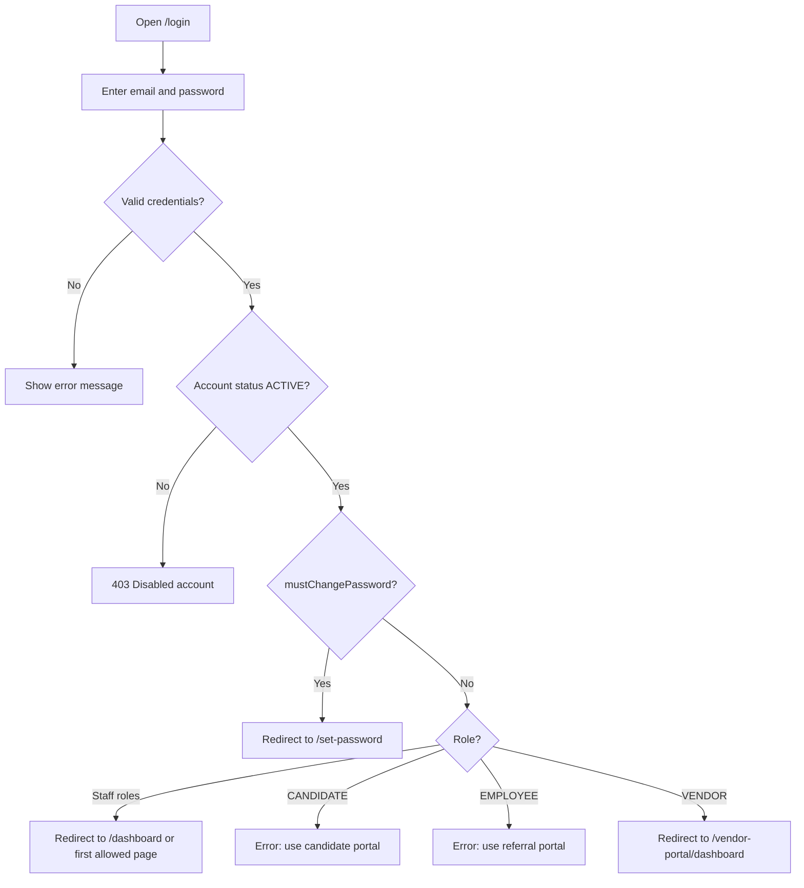
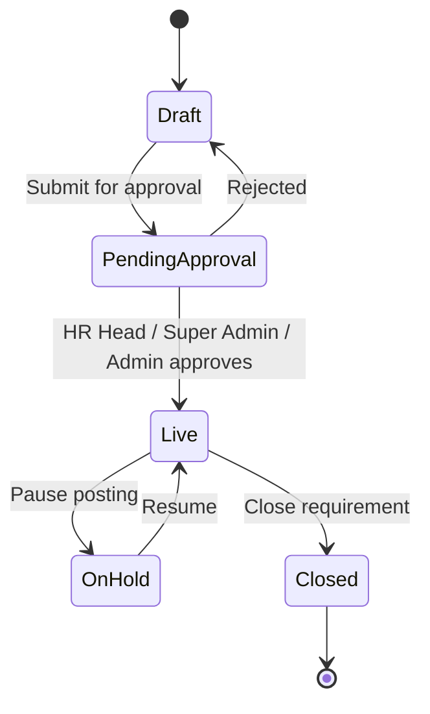
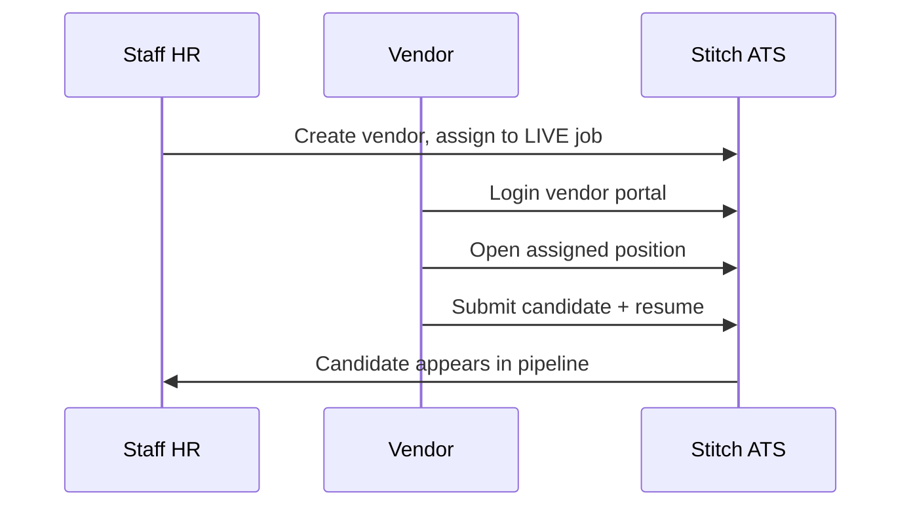
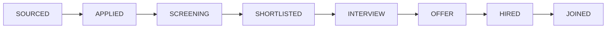
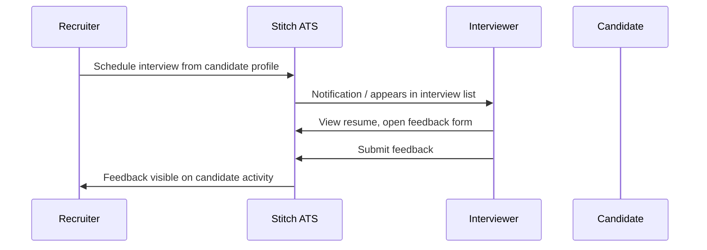
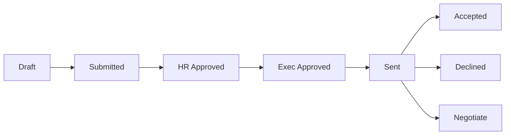
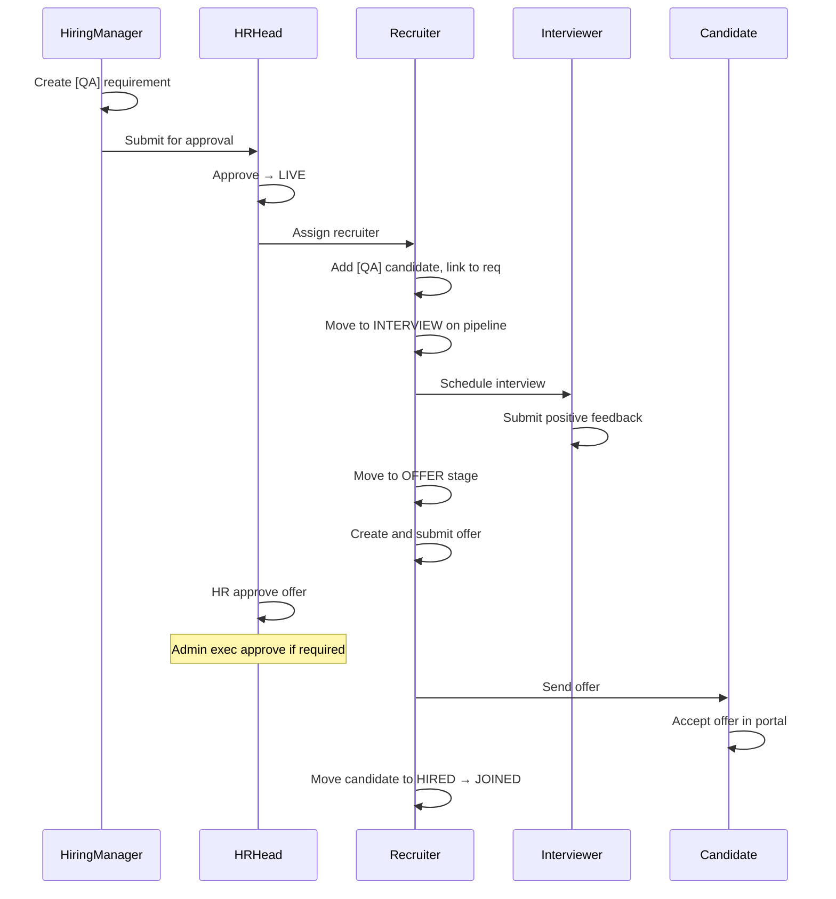

# Application Flows

Detailed step-by-step flows for **Stitch ATS** on production. Each section includes diagrams and numbered steps suitable for testers.

---

## 1. Authentication and session flows

### 1.1 Staff login



**Steps:**
1. Navigate to https://stitch-ats.in/login
2. Enter staff email and password
3. Click Sign in
4. **Expected:** Redirect to dashboard (or first allowed page for role)
5. Sidebar shows only pages permitted for the role

### 1.2 Candidate portal login

1. Navigate to https://stitch-ats.in/portal/login
2. Enter candidate credentials
3. **Expected:** Redirect to `/portal/dashboard` (or `/portal/onboarding` if profile incomplete)

### 1.3 Referral portal login

1. Navigate to https://stitch-ats.in/referral-portal/login
2. Enter employee (or staff) credentials
3. **Expected:** Redirect to `/referral-portal/dashboard`

### 1.4 Candidate self-registration

```mermaid
flowchart LR
  A[/portal/signup] --> B[Fill registration form]
  B --> C[POST register-candidate]
  C --> D[Auto login or redirect to login]
  D --> E[/portal/onboarding]
  E --> F[Complete profile]
  F --> G[/portal/dashboard]
```

1. Open https://stitch-ats.in/portal/signup
2. Complete name, email, password
3. Submit registration
4. **Expected:** Account created with CANDIDATE role; onboarding flow begins

### 1.5 Forgot password

1. On any login page, click **Forgot password**
2. Enter email address
3. Submit (email sent if configured)
4. Open reset link from email
5. Set new password
6. **Expected:** Can log in with new password

### 1.6 Forced password change

1. Log in as user with `mustChangePassword` flag
2. **Expected:** Immediate redirect to `/set-password`
3. Set new password
4. **Expected:** Access to normal app routes

### 1.7 Idle logout

1. Log in successfully
2. Leave browser idle for 15+ minutes (no mouse/keyboard activity)
3. **Expected:** Automatic logout; redirect to login page

### 1.8 Session expiry

1. Log in; manually clear token or wait for 401 from API
2. **Expected:** Redirect to login; "session expired" behavior

---

## 2. Requirement lifecycle flow

### 2.1 Status state machine



### 2.2 Create and approve requirement

| Step | Actor | Action |
|------|-------|--------|
| 1 | Hiring Manager | Create requirement at `/requirements/new` — fill title, department, skills, description |
| 2 | Hiring Manager | Save as **Draft** |
| 3 | Hiring Manager | Submit for approval |
| 4 | — | Status → **Pending Approval**; HR Head notified |
| 5 | HR Head | Open requirement detail → Approve |
| 6 | — | Status → **Live** |
| 7 | Team Lead / HR | Enable portal visibility and posting controls |
| 8 | — | Job appears on candidate portal (if visibility enabled) |

### 2.3 Recruiter assignment

1. HR or Admin opens LIVE requirement detail
2. Navigate to recruiter assignment section
3. Assign one or more recruiters
4. **Expected:** Assigned recruiters see requirement in their scoped list

### 2.4 Interview plan configuration

1. Open requirement detail → Interview stages tab
2. Configure L1, L2, HR interview stages and default panel
3. Save interview plan
4. **Expected:** Plan used when scheduling interviews for linked candidates

### 2.5 Close requirement

1. HR or Admin opens LIVE or ON_HOLD requirement
2. Change status to **Closed**
3. **Expected:** No longer visible for new applications; existing candidates remain

---

## 3. Candidate sourcing flows

### 3.1 Manual sourcing (staff)

```mermaid
flowchart LR
  A[Recruiter] --> B[/candidates/new]
  B --> C[Enter candidate details]
  C --> D[Upload resume optional]
  D --> E[Link to requirement]
  E --> F[Candidate in pipeline SOURCED/APPLIED]
```

### 3.2 Vendor sourcing



### 3.3 Careers portal sourcing

1. Candidate completes onboarding
2. Browses jobs at `/portal/jobs`
3. Opens job detail → Apply
4. **Expected:** Application created; candidate stage APPLIED; visible in staff Careers module (`/features/careers`) for tagged users

### 3.4 Employee referral sourcing

1. Employee logs into referral portal
2. Browses open roles at `/referral-portal/jobs`
3. Submits referral with candidate details and resume
4. **Expected:** Referral tracked in My Referrals; candidate tagged for ERP module (`/features/employee-referral`)

---

## 4. Pipeline flow

### 4.1 Kanban stage movement



1. Open `/pipeline` or `/pipeline/:requirementId`
2. Locate candidate card in current column
3. Drag card to target stage column
4. **Expected:** Stage updates; activity log records change

### 4.2 Rejection

1. Drag candidate to **REJECTED** or use reject action
2. **Expected:** Candidate marked rejected; removed from active funnel

### 4.3 HIRED stage lock

1. Move candidate to **HIRED**
2. Log in as Recruiter — attempt to change stage
3. **Expected:** Blocked with message — only HR leadership can change stage after HIRED
4. Log in as HR Head — change to **JOINED**
5. **Expected:** Allowed

---

## 5. Interview flow



| Step | Actor | Action |
|------|-------|--------|
| 1 | Recruiter | Open candidate profile → Schedule interview (or `/interviews/new`) |
| 2 | Recruiter | Select requirement, stage, date/time, interviewers |
| 3 | — | Interview status: Scheduled |
| 4 | Interviewer | See interview in list (mine filter for interviewers) |
| 5 | Interviewer | Open `/interviews/:id/feedback` |
| 6 | Interviewer | Submit skills ratings, recommendation |
| 7 | — | Interview marked completed; feedback stored |

### Interview filters (staff)

- **All** — scoped by role
- **Upcoming** — future scheduled
- **Needs feedback** — completed without feedback
- **Decided** — feedback submitted
- **Cancelled** — cancelled interviews

---

## 6. Offer flow



| Step | Actor | Action |
|------|-------|--------|
| 1 | Recruiter / HR | Create offer at `/offers/new` for candidate |
| 2 | — | Status: Draft |
| 3 | Creator | Submit for approval |
| 4 | HR Head | Approve (HR approval) |
| 5 | Admin | Approve (executive approval) |
| 6 | Recruiter / HR | Send offer to candidate |
| 7 | — | Status: Sent; candidate notified |
| 8 | Candidate | Open `/portal/offers/:id` |
| 9 | Candidate | Accept or Decline |
| 10 | Staff | View updated status on offer detail |

### Compensation visibility

- HR Head, HR Manager, Admin, Super Admin: full compensation
- Recruiter: may have limited visibility depending on offer state
- Interviewer: no offer access (default pages)

---

## 7. Portal-specific flows

### 7.1 Candidate portal — full journey

```
Signup → Onboarding (profile gate) → Dashboard → Browse jobs → Apply
  → Track on Applied jobs → Attend interview (external) → View/respond to offer
```

**Profile gate:** Until `profileComplete`, user is redirected to `/portal/onboarding` when accessing main portal routes.

### 7.2 Vendor portal — full journey

```
Login → Dashboard (stats) → Assigned positions → Job detail → Submit candidate
  → Submissions list (via dashboard link)
```

### 7.3 Referral portal — full journey

```
Login → Dashboard (referral code, stats) → Open roles → Job detail → Submit referral
  → My Referrals → Referral detail → Rewards program info
```

---

## 8. Admin flows

### 8.1 User invite and management

1. Super Admin → `/admin/users`
2. Invite user — email, name, role, department
3. User receives invite / temp password flow
4. Assign feature tags if needed (careers, employee_referral, mis)
5. Disable user → status DISABLED → cannot log in

### 8.2 Role access editor

1. Super Admin → `/admin/role-access`
2. Select role (e.g. RECRUITER)
3. Toggle page access (e.g. remove vendors page)
4. Save
5. **Expected:** Users with that role no longer see toggled pages in sidebar

### 8.3 Catalog management

- **Departments** — `/admin/departments` — add/delete departments used on requirements
- **Clients** — `/admin/clients` — client names for job postings
- **Skills** — `/admin/skills` — skill catalog for requirements and matching

### 8.4 Interview panels

1. Admin → `/admin/interview-panels`
2. Configure default interviewer panels per job level (L1, L2, HR)
3. **Expected:** Defaults suggested when scheduling interviews

---

## 9. Golden path — hire someone end-to-end

Multi-role sequence for scenario **SC-E2E-001**:



**Handoff points for testers:**
- Step 3: Switch to HR Head account
- Step 5: Switch to Recruiter account
- Step 8: Switch to Interviewer account
- Step 14: Switch to Candidate account (portal)
- Step 16: Back to Recruiter for final pipeline move

Detailed steps are in [TEST_CASES.md](./TEST_CASES.md) — **TC-E2E-001**.

---

## Related documents

- [MIND_MAP.md](./MIND_MAP.md) — structural overview
- [TEST_SCENARIOS.md](./TEST_SCENARIOS.md) — test scenarios derived from these flows
- [ROLES_AND_ACCESS.md](./ROLES_AND_ACCESS.md) — who can perform each action
