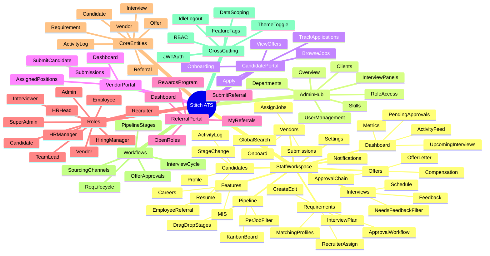

# Application Mind Map

Visual and structural map of **Stitch ATS**. Use this document to understand what exists before diving into flows and test cases.

---

## Mermaid mind map



---

## Structural outline

### 1. Portals (5 surfaces)

| Portal | Users | Entry |
|--------|-------|-------|
| Staff workspace | Internal hiring team | `/login` |
| Admin hub | Admin, Super Admin | `/admin` |
| Candidate portal | Job applicants | `/portal/login` |
| Vendor portal | Staffing vendors | `/login` (VENDOR role) |
| Referral portal | Employees (+ staff) | `/referral-portal/login` |

---

### 2. Staff workspace modules

| Module | Route prefix | Primary actions |
|--------|--------------|-----------------|
| Dashboard | `/dashboard` | View metrics, interviews, approvals, quick actions |
| Requirements | `/requirements` | Create jobs, approve, assign recruiters, configure interview plan |
| Candidates | `/candidates` | Add candidates, view profiles, upload resumes, change stage |
| Pipeline | `/pipeline` | Kanban view, drag-and-drop stage changes |
| Interviews | `/interviews` | Schedule, edit, submit feedback, filter by status |
| Offers | `/offers` | Create, approve, send, track offer status |
| Vendors | `/vendors` | Onboard vendors, assign jobs, view submissions |
| Features — Careers | `/features/careers` | Portal-applied candidates (feature tag required) |
| Features — ERP | `/features/employee-referral` | Referral-sourced candidates (feature tag required) |
| Features — MIS | `/features/mis` | Recruitment KPIs dashboard (feature tag required) |
| Notifications | `/notifications` | In-app alerts, approval reminders |
| Settings | `/settings` | Profile, password, theme, language |

---

### 3. Admin hub modules

| Module | Route | Access |
|--------|-------|--------|
| Overview | `/admin` | Admin, Super Admin |
| User Management | `/admin/users` | Super Admin (UI: Admin can view) |
| Departments | `/admin/departments` | Admin, Super Admin |
| Clients | `/admin/clients` | Admin, Super Admin |
| Skills | `/admin/skills` | Admin, Super Admin |
| Role Access | `/admin/role-access` | Super Admin only |
| Interview Panels | `/admin/interview-panels` | Admin, Super Admin |

---

### 4. Roles and primary actions

| Role | Portal | Key actions |
|------|--------|-------------|
| **SUPER_ADMIN** | Staff + Admin | Everything; user mgmt; role access editor |
| **ADMIN** | Staff + Admin | Catalogs, panels; exec offer approval; limited user create |
| **HR_HEAD** | Staff | Approve requirements & offers (HR); org-wide data |
| **HR_MANAGER** | Staff | Full recruiting ops; org-wide data; no direct req approval |
| **RECRUITER** | Staff | Source candidates, schedule interviews; scoped data |
| **TEAM_LEAD** | Staff | Like recruiter + offers page; posting controls |
| **HIRING_MANAGER** | Staff | Create reqs for own jobs; narrow default pages |
| **INTERVIEWER** | Staff | View assigned interviews; submit feedback only |
| **CANDIDATE** | Candidate portal | Apply, track, respond to offers |
| **VENDOR** | Vendor portal | Submit candidates on assigned positions |
| **EMPLOYEE** | Referral portal | Refer candidates, track referrals |

---

### 5. Core entities

```
Organization
├── Users (12 roles)
├── Departments, Clients, Skills (catalogs)
├── Requirements (job openings)
│   ├── Status: Draft → Pending Approval → Live → On Hold → Closed
│   ├── Recruiter assignments
│   ├── Interview plan / hiring stages
│   └── Vendor assignments
├── Candidates
│   ├── Pipeline stage (SOURCED … JOINED / REJECTED)
│   ├── Resume
│   ├── Linked requirements
│   └── Source: Manual | Vendor | Portal | Referral
├── Interviews
│   ├── Scheduled / Completed / Cancelled
│   └── Feedback
├── Offers
│   ├── Draft → Submitted → HR Approved → Exec Approved → Sent → Accepted/Declined
│   └── Offer letter (PDF)
├── Vendors
│   └── Submissions
└── Activity logs (audit trail)
```

---

### 6. Sourcing channels

| Channel | Actor | Lands in |
|---------|-------|----------|
| Manual add | Recruiter / HR | Candidates list + Pipeline |
| Vendor submission | Vendor | Staff pipeline (via vendor link) |
| Careers portal apply | Candidate | Pipeline + Careers feature module |
| Employee referral | Employee | Pipeline + ERP feature module |

---

### 7. Pipeline stages

```
SOURCED → APPLIED → SCREENING → SHORTLISTED → INTERVIEW → OFFER → HIRED → JOINED
                                                              ↘ REJECTED (any stage)
```

**Lock rule:** After HIRED, only HR leadership can change stage.

---

### 8. Offer approval chain

```
Create (Recruiter/HR) → Submit → HR Approve → Exec Approve (Admin) → Send → Candidate Accept/Decline
```

---

### 9. Cross-cutting concerns

| Concern | Behavior |
|---------|----------|
| **Authentication** | JWT in localStorage; Bearer token on API calls |
| **Page access** | Sidebar filtered by role + `allowedPages` config |
| **Feature tags** | `careers`, `employee_referral`, `mis` unlock feature routes |
| **Data scoping** | Recruiters/HMs/Interviewers see only assigned/owned data |
| **Idle logout** | 15 minutes inactivity |
| **Global search** | Candidates, requirements, interviews, users (scoped) |
| **Notifications** | Pending approvals, feedback reminders |

---

## Related documents

- [APPLICATION_FLOW.md](./APPLICATION_FLOW.md) — how each workflow behaves step-by-step
- [ROLES_AND_ACCESS.md](./ROLES_AND_ACCESS.md) — detailed permission matrix
- [TEST_SCENARIOS.md](./TEST_SCENARIOS.md) — what to test
